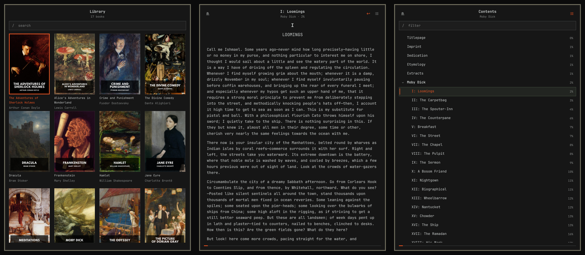

# Reader

A minimal ebook reader for the Omarchy bar. A library of covers, a table of
contents that works, and it remembers your place. It scrolls or turns pages,
by day or by night, and lets you select and copy. Offline; no accounts, no
network.



Plugin id: `clumzeez.reader`.

## Install

```sh
omarchy plugin add https://github.com/ClumZeez/omarchy-reader.git --enable
```

Move it with `omarchy bar move clumzeez.reader --after <widget-id>`.

Reader needs nothing beyond what Omarchy already ships: the reader is plain
QML and the book converter is Python's standard library.

## Reading

Left-click the book icon in the bar. The first time you see your library;
after that Reader opens the book you were reading, where you left it.
Right-click the icon to go straight to the library.

The keys are the same letters everywhere, and `?` shows them all:

| Where | Keys |
|---|---|
| a book | `←` `→` previous, next page · `Space` / `Shift+Space`, `PgDn` / `PgUp` the same · `↑` `↓` scroll a little (in pages: turn) · `[` `]` previous, next chapter · `g` / `G`, `Home` / `End` start, end · `Backspace` back from a jump · `t` contents · `+` `-` `0` text size |
| anywhere | `b` library, and back to the book · `s` settings · `p` pages or scrolling · `d` day, night, or the shell's colours · `?` every key · `Esc` one step back, then close · `Tab` / `Shift+Tab` the next, previous panel on the bar |
| the library | arrows move · `Enter` open · `/` search · `r` look for new books · `o` open the book folder |
| the contents | `↑` `↓` move · `←` `→` fold, unfold · `Enter` go there · `/` filter |

`h` `j` `k` `l` work as the arrows, and the letters work in capitals too, as
in Omarchy's own panels.

With the mouse: click a cover, a chapter, a link; click the title at the top
of a book for its contents; the wheel scrolls, or turns pages. Dragging over
text selects it, across paragraphs too, and what is selected is copied to the
clipboard as you let go. A double click takes a word, a third the paragraph.

To open or close Reader from the keyboard, add a line to
`~/.config/hypr/bindings.lua`, with a chord nothing else uses (Omarchy's
defaults leave `SUPER + CTRL + G` free):

```lua
o.bind("SUPER + CTRL + G", "Reader", "omarchy-shell shell toggle clumzeez.reader")
```

To take over a chord that is already bound, put `hl.unbind("…")` with the
same chord on the line before.

## Settings

The gear at the top of the library, or `s` from anywhere.

- **Turn pages** — a page at a time instead of scrolling. A page starts and
  ends between two lines, never through one; a picture that does not fit
  waits for the next page, and a heading goes over with what it heads.
- **Appearance** — Auto keeps your shell's colours; Day and Night are paper
  and ink of their own.
- **Text size** — also `+` `-` `0` while reading.
- **Open book folder** — in your file manager, to drop new books in.
- **Free books** — three libraries of public-domain books worth knowing.
- **Keyboard Shortcuts** — in the corner; every key, as `?` shows them.

## Your books

Reader looks in `~/Books`, `~/Documents/Books`, `~/Documents/EPUB`,
`~/Documents/Ebooks` and `~/Calibre Library`, including their subfolders.
To use another folder:

```sh
omarchy bar set clumzeez.reader folder ~/path/to/books
```

Books are read where they are and never modified. Your place in each book
follows the book's content, not its file name: rename the file, move it to
another folder or replace its cover and Reader still opens it where you
stopped. Any jump — a chapter from the contents, a link, the start or the
end — can be undone with `Backspace`, so a slip of the finger never loses
your place.

To open a book that is not in the library:

```sh
omarchy-shell reader open ~/Downloads/some-book.epub
```

## Formats

| Format | |
|---|---|
| EPUB 2 and 3 (`.epub`, `.kepub.epub`) | read in Reader |
| Kindle (`.mobi`, `.azw`, `.azw3`, `.prc`) | read in Reader |
| FictionBook (`.fb2`, `.fb2.zip`, `.fbz`) | read in Reader |
| Plain text and single web pages (`.txt`, `.html`) | read in Reader |
| Comic archives (`.cbz`) | read in Reader, a page per picture |
| PDF and DjVu | listed in the library, opened in your default viewer |

Books with DRM cannot be opened by any reader but the vendor's; Reader says
so instead of showing garbage. Font obfuscation, which many publishers use,
is not DRM and is fine.

Reader shows a book's words, pictures and structure in your shell's own
typeface and colours. It keeps what carries meaning — emphasis, headings,
verse, quotations, lists, tables, notes and their links — and drops the
publisher's fonts, colours and page furniture.

## Where things are kept

| | |
|---|---|
| Your place in each book, and the settings | `~/.local/state/omarchy/settings/reader.json` |
| Covers and converted books (safe to delete) | `~/.cache/omarchy-reader/` |

Nothing is ever written next to your books or inside the plugin. Should the
first file ever become unreadable, Reader sets it aside as
`reader.json.damaged` instead of writing over it.

## Update and remove

```sh
omarchy plugin update clumzeez.reader
omarchy plugin remove clumzeez.reader
```

After an update, restart the shell (`omarchy restart shell`) for the new
version to take effect; until then the popout says so instead of opening.
Removing the plugin leaves the locations above in place; delete them if you
want a clean slate.

## How it works

`Service.qml` runs once per shell and owns everything shared: the saved
state, the library, the open book. `BarWidget.qml` runs once per monitor and
is only a view onto it. Books are converted by `bin/reader`, a Python program
using only the standard library, into a flat list of blocks (paragraph,
heading, picture, …) that a `ListView` draws natively — no web engine. The
conversion happens in a separate process, so a large or broken book can
never stall the bar.

That process works within fixed bounds: two gigabytes of memory, a gigabyte
of pictures a book, 48 MB of converted text. A file built to exhaust the
machine is refused with a plain sentence; no real book comes near any of
them. The cache as a whole is kept under 1.5 GB by dropping the books opened
longest ago, which are simply converted again when next opened.

A reading position is the block at the top of the view, how far through
that block you are, and the block's opening words, so it survives changes to
the text size, the panel width and the converter itself.

Text is drawn by read-only text edits, the one text item that can say which
character is under a point; that is what selecting rests on. Their lines are
a fixed whole number of pixels apart, which is what lets a page be cut
between two of them.

## Tests

```sh
tests/run.sh          # everything
tests/run.sh js       # Reader.js, under node
tests/run.sh py       # the converter, under unittest
tests/run.sh qml      # the interface, offscreen
tests/run.sh e2e      # interface and converter together, across restarts
```

The interface tests run the real Omarchy UI kit and theme against stand-ins
for the few Quickshell types that need a compositor; nothing touches the
running shell, no window opens and nothing reaches the clipboard. The
converter's tests build their own
books; they also check your library and any samples in
`~/.cache/omarchy-reader-test-samples` when those exist, and skip that part when
they do not.

## Licence

MIT. See `LICENSE` and `NOTICE.md`.
